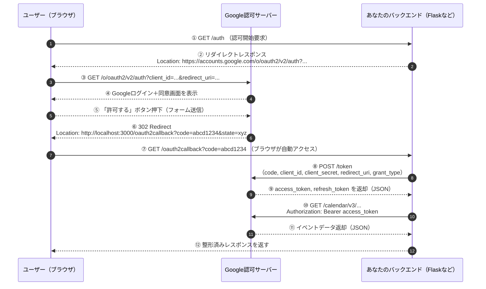

```mermaid
sequenceDiagram
    autonumber

    participant U as ユーザー（ブラウザ）
    participant GAuth as Google認可サーバー
    participant B as あなたのバックエンド（Flaskなど）

    %% ① 認可リクエスト
    U->>B: ① GET /auth （認可開始要求）
    B-->>U: ② リダイレクトレスポンス<br>Location: https://accounts.google.com/o/oauth2/v2/auth?...

    %% ② Google認可画面表示
    U->>GAuth: ③ GET /o/oauth2/v2/auth?client_id=...&redirect_uri=...
    GAuth-->>U: ④ Googleログイン＋同意画面を表示

    %% ③ ユーザーが許可を押す
    U-->>GAuth: ⑤ 「許可する」ボタン押下（フォーム送信）

    %% ④ Googleがリダイレクトを指示
    GAuth-->>U: ⑥ 302 Redirect<br>Location: http://localhost:3000/oauth2callback?code=abcd1234&state=xyz
    U->>B: ⑦ GET /oauth2callback?code=abcd1234 （ブラウザが自動アクセス）

    %% ⑤ トークン交換（サーバー間通信）
    B->>GAuth: ⑧ POST /token<br>（code, client_id, client_secret, redirect_uri, grant_type）
    GAuth-->>B: ⑨ access_token, refresh_token を返却（JSON）

    %% ⑥ APIアクセス
    B->>GAuth: ⑩ GET /calendar/v3/...<br>Authorization: Bearer access_token
    GAuth-->>B: ⑪ イベントデータ返却（JSON）
    B-->>U: ⑫ 整形済みレスポンスを返す
```
