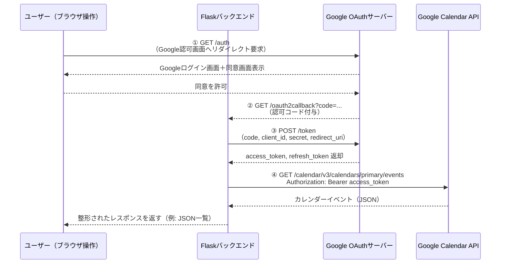
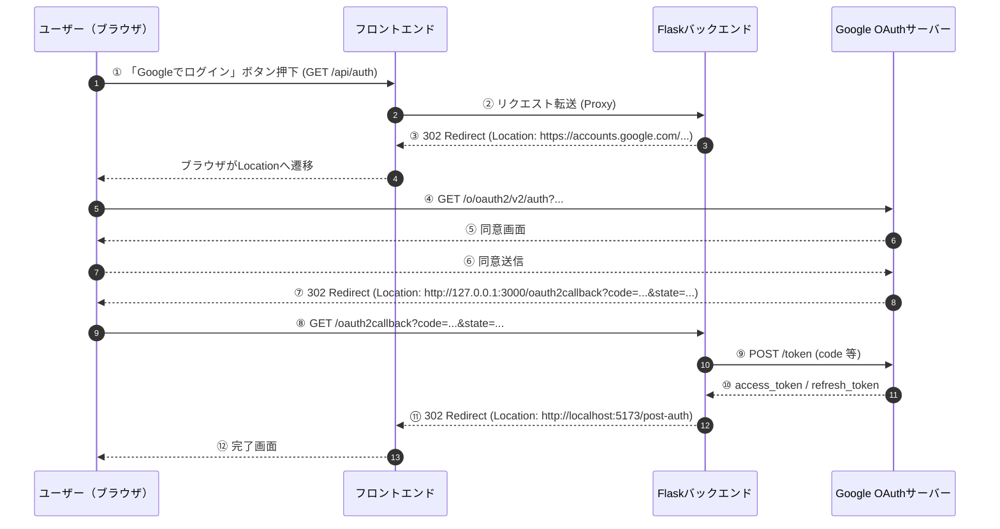
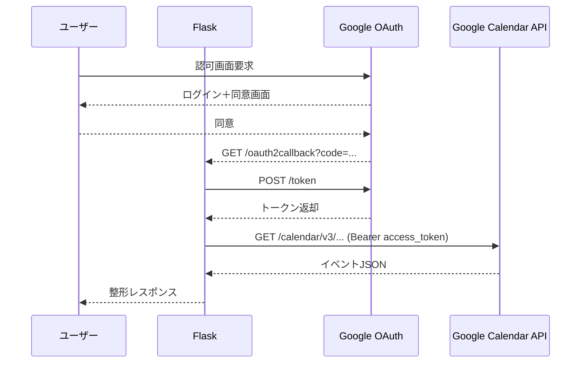

```mermaid
sequenceDiagram
    participant U as ユーザー（ブラウザ操作）
    participant B as Flaskバックエンド
    participant GAuth as Google OAuthサーバー
    participant GCal as Google Calendar API

    U->>GAuth: ① GET /auth<br>（Google認可画面へリダイレクト要求）
    GAuth-->>U: Googleログイン画面＋同意画面表示
    U-->>GAuth: 同意を許可
    GAuth-->>B: ② GET /oauth2callback?code=...<br>（認可コード付与）
    B->>GAuth: ③ POST /token<br>（code, client_id, secret, redirect_uri）
    GAuth-->>B: access_token, refresh_token 返却
    B->>GCal: ④ GET /calendar/v3/calendars/primary/events<br>Authorization: Bearer access_token
    GCal-->>B: カレンダーイベント（JSON）
    B-->>U: 整形されたレスポンスを返す（例: JSON一覧）
```

// filepath: /Users/sakaikanji/Documents/Calendar/backend/calendarAPI.md

```mermaid
sequenceDiagram
    autonumber
    participant U as ユーザー（ブラウザ）
    participant F as フロントエンド
    participant B as Flaskバックエンド
    participant G as Google OAuthサーバー

    U->>F: ① 「Googleでログイン」ボタン押下 (GET /api/auth)
    F->>B: ② リクエスト転送 (Proxy)
    B-->>F: ③ 302 Redirect (Location: https://accounts.google.com/...)
    F-->>U: ブラウザがLocationへ遷移
    U->>G: ④ GET /o/oauth2/v2/auth?...
    G-->>U: ⑤ 同意画面
    U-->>G: ⑥ 同意送信
    G-->>U: ⑦ 302 Redirect (Location: http://127.0.0.1:3000/oauth2callback?code=...&state=...)
    U->>B: ⑧ GET /oauth2callback?code=...&state=...
    B->>G: ⑨ POST /token (code 等)
    G-->>B: ⑩ access_token / refresh_token
    B-->>F: ⑪ 302 Redirect (Location: http://localhost:5173/post-auth)
    F-->>U: ⑫ 完了画面
```

```mermaid
sequenceDiagram
    participant U as ユーザー
    participant B as Flask
    participant GAuth as Google OAuth
    participant GCal as Google Calendar API

    U->>GAuth: 認可画面要求
    GAuth-->>U: ログイン＋同意画面
    U-->>GAuth: 同意
    GAuth-->>B: GET /oauth2callback?code=...
    B->>GAuth: POST /token
    GAuth-->>B: トークン返却
    B->>GCal: GET /calendar/v3/... (Bearer access_token)
    GCal-->>B: イベントJSON
    B-->>U: 整形レスポンス
```