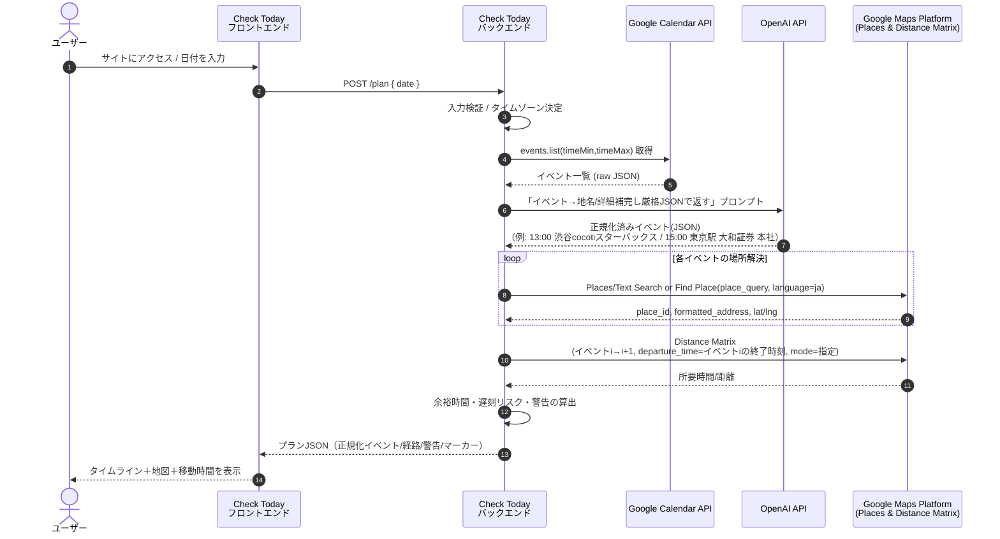

```mermaid
sequenceDiagram
autonumber
actor U as ユーザー
participant F as Check Today<br/>フロントエンド
participant B as Check Today<br/>バックエンド
participant GCal as Google Calendar API
participant OAI as OpenAI API
participant GMaps as Google Maps Platform<br/>(Places & Distance Matrix)

U->>F: サイトにアクセス / 日付を入力
F->>B: POST /plan { date }
B->>B: 入力検証 / タイムゾーン決定
B->>GCal: events.list(timeMin,timeMax) 取得
GCal-->>B: イベント一覧 (raw JSON)
B->>OAI: 「イベント→地名/詳細補完し厳格JSONで返す」プロンプト
OAI-->>B: 正規化済みイベント(JSON)<br/>（例: 13:00 渋谷cocotiスターバックス / 15:00 東京駅 大和証券 本社）
loop 各イベントの場所解決
  B->>GMaps: Places/Text Search or Find Place(place_query, language=ja)
  GMaps-->>B: place_id, formatted_address, lat/lng
end
B->>GMaps: Distance Matrix<br/>(イベントi→i+1, departure_time=イベントiの終了時刻, mode=指定)
GMaps-->>B: 所要時間/距離
B->>B: 余裕時間・遅刻リスク・警告の算出
B-->>F: プランJSON（正規化イベント/経路/警告/マーカー）
F-->>U: タイムライン＋地図＋移動時間を表示
```